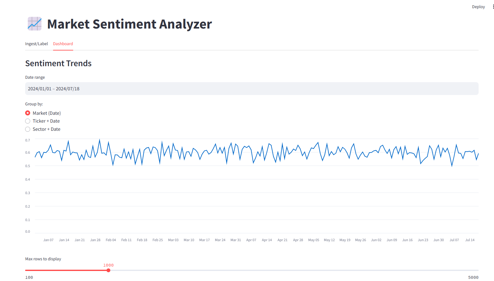
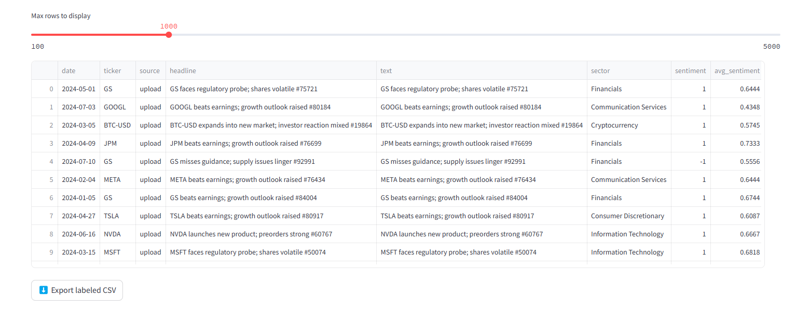
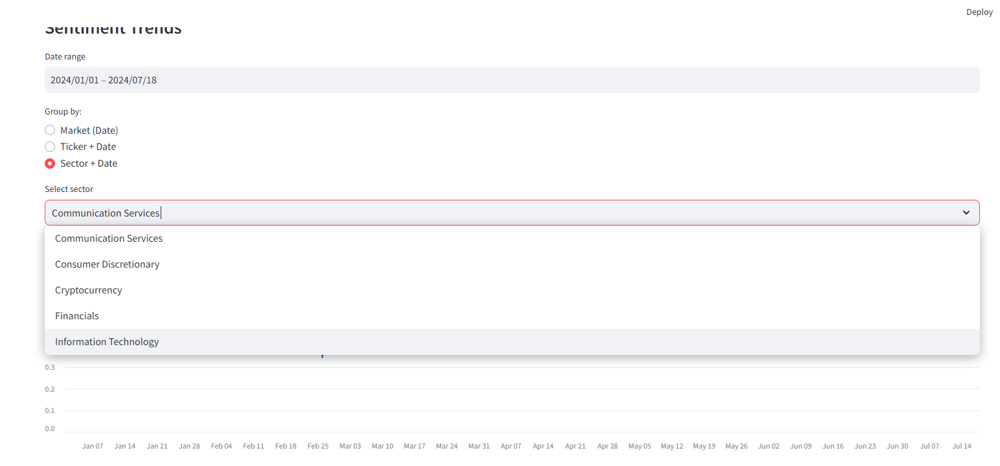
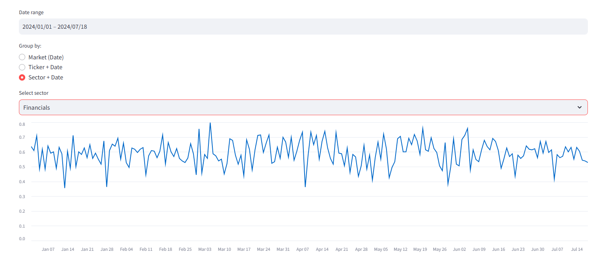
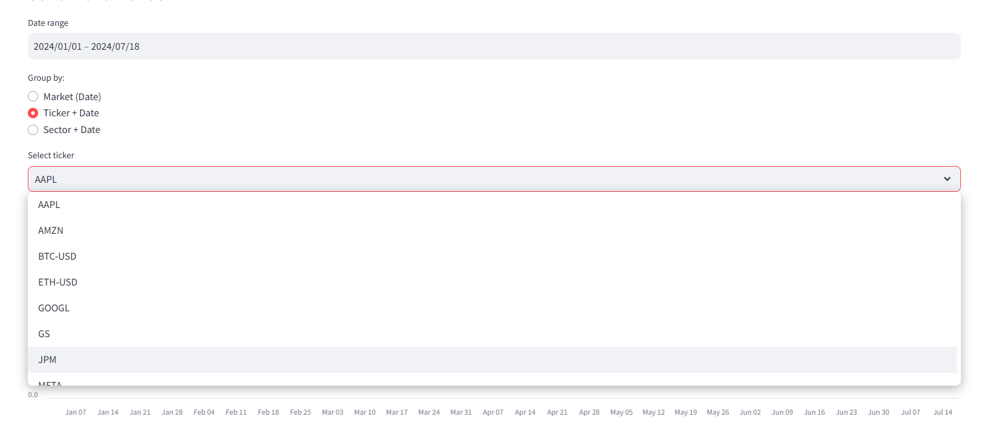
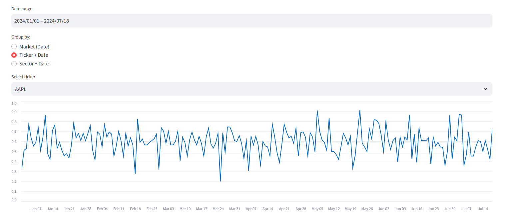

# 📊 Market Sentiment Analyzer
## Overview
The **Market Sentiment Analyzer** is an end-to-end NLP project for financial applications.
It ingests news/headlines, labels sentiment (positive/neutral/negative), and visualizes market, ticker, and sector sentiment trends.

## 👉 Business value:
- **Traders / PMs**: identify sentiment-driven momentum & risk alerts
- **Product managers**: showcase applied LLM/NLP skills for finance
- **Quant researchers**: integrate sentiment factors into alpha models

---

## ✨ Features
- Ingest CSV files or upload news datasets
- Label sentiment using:
  - **VADER** (fast, rule-based baseline)
  - **FinBERT** (ProsusAI, financial tone)
  - **RoBERTa** (CardiffNLP, social/news sentiment)
- Dashboard (Streamlit):
  - Market sentiment by date
  - Ticker-level sentiment
  - Sector-level sentiment
  - Date range filters, CSV export
- Optimizations:
  - Cached aggregations
  - Duplicate deduplication before labeling
  - Tunable batch size & max sequence length
- Benchmarking harness to measure throughput across datasets & models

- 
---
### Screenshots









## 🚀 Quick Start

### 1. Install
```bash
git clone https://github.com/jerome79/market-sentiment-analyzer.git
cd market-sentiment-analyzer
cp .env.example .env
pip install -r requirements.txt

#### Example Input CSV

```csv
date,ticker,headline,text
2025-01-01,AAPL,Apple rises,Apple stock surges after earnings
2025-01-01,TSLA,Tesla falls,Tesla shares dip after recall news
```
### Docker quickstart
```bash
docker compose build --no-cache
docker compose up
# open http://localhost:8501
```

#### Example Labeled Output

```csv
date,ticker,headline,text,sentiment,confidence
2025-01-01,AAPL,Apple rises,Apple stock surges after earnings,1,0.95
2025-01-01,TSLA,Tesla falls,Tesla shares dip after recall news,-1,0.90
```


## Quick Demo (60 seconds)

```bash
git clone https://github.com/jerome79/market-sentiment-analyzer.git
cd market-sentiment-analyzer
make demo
# then open http://localhost:8501
```
## Benchmarking

### VADER, 10k rows
python scripts/benchmark.py --csv data/news_perf_test_10k.csv --model vader

### FinBERT, 50k rows, batch 32
python scripts/benchmark.py --csv data/news_perf_test_50k.csv --model ProsusAI/finbert --batch-size 32

### RoBERTa, 100k rows, capped at 20k
python scripts/benchmark.py --csv data/news_perf_test_100k.csv --model cardiffnlp/twitter-roberta-base-sentiment-latest --limit 20000

### Example Benchmark (local CPU, batch=32)
Dataset	Model	Rows	Unique  Rows	Dedupe Ratio	Rows/sec
10k	    VADER	10k	    10k	    0%	    0               31143.4
10k	    FinBERT	10k	    10k	    0%	    0               53
10k	    RoBERTa	10k	    10k	    0%  	0               68.7
10k	    VADER	10k	    10k	    5%	    0.05            33133.1
10k	    FinBERT	10k	    10k	    0%	    0.05            53
10k	    RoBERTa	10k	    10k	    0%  	0.05            71.2

### Report saved as a CSV
python scripts/benchmark.py --csv data/news_perf_test_50k.csv --model ProsusAI/finbert --results out/bench.csv
